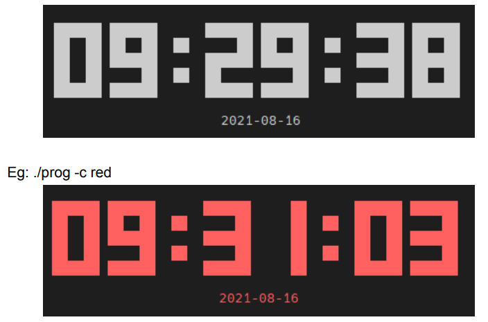

# Digital Clock

## CO222 Programming Methodology | Project 1

### Project Description

Developed a digital clock program for the Linux terminal that prints the current time and date. If a color is given as an argument to the program, the output will be printed in the specified color.

### Features

- Displays the current time and date.
- Supports colored output based on user input.

### Technologies Used

- C
- Linux

### Project Type

- Individual

### Usage

1. **Compile the Program:**
    ```bash
    gcc -o digital_clock E18115project1.c
    ```

2. **Run the Program:**
    ```bash
    ./digital_clock [color]
    ```
   - `[color]` is an optional argument to specify the color of the output (e.g., red, green, blue).

### Example

- Running the program without a color argument:
    ```bash
    ./digital_clock
    ```
    

- Running the program with a color argument:
    ```bash
    ./digital_clock red
    ```
    (Output will be in red)

### Author

- Gowsigan A
